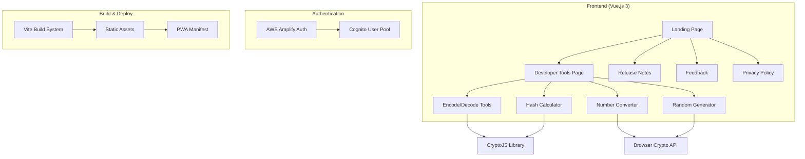
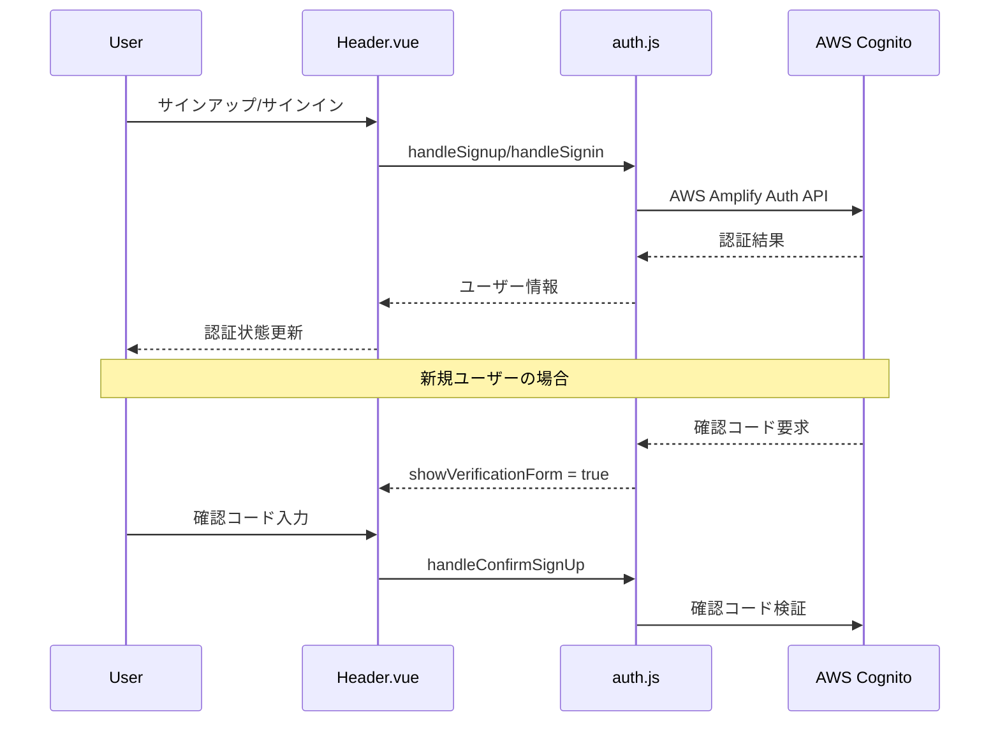
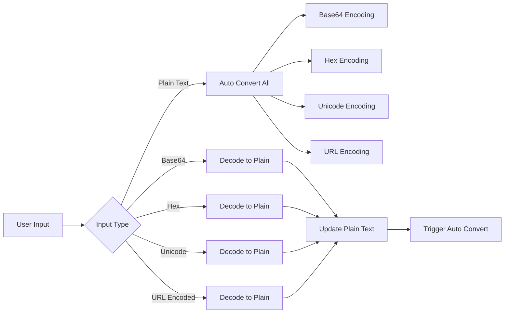

# 設計書

## 概要

uji52.comは、Vue.js 3とBootstrap 5を基盤とした開発者向けツールWebアプリケーションです。クライアントサイドで動作する各種変換・計算ツールを提供し、AWS Amplifyによる認証機能とPWA対応を実装しています。

## アーキテクチャ

### システム構成



### 技術スタック

- **フロントエンド**: Vue.js 3 (Composition API)
- **UIフレームワーク**: Bootstrap 5
- **ビルドツール**: Vite
- **暗号化ライブラリ**: CryptoJS
- **認証**: AWS Amplify Auth (Cognito)
- **PWA**: Vite PWA Plugin
- **テスト**: Jest + Vue Test Utils
- **リンター**: ESLint + Prettier

## コンポーネント設計

### 1. アプリケーション構造

```
src/
├── App.vue                 # ルートコンポーネント
├── main.js                 # エントリーポイント
├── router.js               # ルーティング設定
├── components/
│   ├── Header.vue          # ナビゲーション・認証UI
│   ├── Footer.vue          # フッター・SNSリンク
│   ├── Landing.vue         # ランディングページ
│   ├── Develop.vue         # 開発ツールページ（メイン）
│   ├── ReleaseNote.vue     # リリースノート
│   ├── Feedback.vue        # フィードバック
│   └── Privacy.vue         # プライバシーポリシー
└── utils/
    └── auth.js             # 認証ユーティリティ
```

### 2. 開発ツールページ (Develop.vue)

#### コンポーネント責務
- **単一責任**: 全ての開発ツール機能を統合管理
- **リアクティブ**: Vue 3 Composition APIによるリアルタイム変換
- **エラーハンドリング**: 各機能セクションでの独立したエラー管理

#### 状態管理

```javascript
// エンコード/デコード関連
const plane = ref('')           // 元文字列
const strHex = ref('')          // 16進数
const b64str = ref('')          // Base64
const b64urlstr = ref('')       // Base64URL
const unicode = ref('')         // Unicode
const urlencode = ref('')       // URLエンコード
const encodeError = ref('')     // エラーメッセージ

// ハッシュ計算関連
const hashPlain = ref('')       // ハッシュ対象文字列
const hashHex = ref('')         // 16進数表現
const hashMd5 = ref('')         // MD5ハッシュ
const hashSha1 = ref('')        // SHA1ハッシュ
const hashSha256 = ref('')      // SHA256ハッシュ
const hashSha512 = ref('')      // SHA512ハッシュ
// ... Base64/Base64URL形式のハッシュ値

// 数値変換関連
const bin = ref('')             // 2進数
const quat = ref('')            // 4進数
const oct = ref('')             // 8進数
const dec = ref('')             // 10進数
const hex = ref('')             // 16進数

// ランダム生成関連
const randomseed = ref('')      // 文字セット
const randomlength = ref(10)    // 文字列長
const randomvalue = ref('')     // 生成結果
```

### 3. 認証システム (Header.vue + auth.js)

#### 認証フロー



#### 認証状態管理
- **リアクティブ認証状態**: `isAuthenticated`, `username`
- **モーダル管理**: Bootstrap Modal APIによる認証UI
- **セッション管理**: AWS Amplifyによる自動セッション管理

## データモデル

### 1. 変換処理データフロー



### 2. ハッシュ計算データフロー

```javascript
// 文字列入力時の処理フロー
watch(() => hashPlain.value, (newValue) => {
  if (!newValue) {
    // 全ハッシュ値をクリア
    return
  }

  // 16進数表現生成
  hashHex.value = stringToHex(newValue)

  // 各種ハッシュ計算
  hashMd5.value = CryptoJS.MD5(newValue).toString()
  hashSha1.value = CryptoJS.SHA1(newValue).toString()
  hashSha256.value = CryptoJS.SHA256(newValue).toString()
  hashSha512.value = CryptoJS.SHA512(newValue).toString()

  // Base64形式
  hashSha1b64.value = CryptoJS.SHA1(newValue).toString(CryptoJS.enc.Base64)
  // ... 他のハッシュアルゴリズムも同様
})
```

### 3. 数値変換データモデル

```javascript
// 各進数間の変換ロジック
const convertFromBase = (value, fromBase, targetBases) => {
  const decimal = parseInt(value, fromBase)
  return targetBases.map(base => decimal.toString(base))
}

// バリデーション規則
const validationRules = {
  binary: /^[0-1]+$/,
  quaternary: /^[0-3]+$/,
  octal: /^[0-7]+$/,
  decimal: /^[0-9]+$/,
  hexadecimal: /^[0-9a-fA-F]+$/
}
```

## インターフェース設計

### 1. ユーザーインターフェース

#### レスポンシブデザイン
- **Bootstrap Grid System**: `col-md-*`クラスによる画面サイズ対応
- **モバイルファースト**: 小画面から大画面への段階的拡張
- **アクセシビリティ**: 適切なラベル、ARIA属性、キーボードナビゲーション

#### フォーム設計
```html
<!-- エンコード/デコードセクション -->
<div class="row">
  <div class="col-md-6 mb-3">
    <label for="plane">文字列</label>
    <input id="plane" v-model="plane" class="form-control" />
  </div>
</div>

<!-- ハッシュ計算セクション -->
<div class="row">
  <div class="col-md-3 mb-3">
    <label for="hashSha256">SHA256</label>
    <input id="hashSha256" v-model="hashSha256" class="form-control" readonly />
  </div>
</div>
```

### 2. API設計

#### 内部関数インターフェース

```javascript
// エンコード/デコード関数
interface EncodingUtils {
  stringToHex(str: string): string
  hexToString(hex: string): string
  stringToBase64(str: string): string
  base64ToString(base64: string): string
  stringToUnicode(str: string): string
  unicodeToString(unicode: string): string
}

// 認証関数
interface AuthUtils {
  handleSignup(username: string, email: string, password: string): Promise<SignUpResult>
  handleSignin(username: string, password: string): Promise<SignInResult>
  handleSignout(): Promise<void>
  checkCurrentUser(): Promise<User | null>
}
```

## エラーハンドリング

### 1. エラー分類と処理

```javascript
// カスタムエラークラス
class UndecodableError extends Error {
  constructor(message) {
    super(message)
    this.name = 'UndecodableError'
  }
}

// エラーメッセージ定数
const errorMessages = {
  invalidBinary: 'Invalid binary string',
  invalidQuaternary: 'Invalid quaternary string',
  invalidDecimal: 'Invalid decimal string',
  invalidHexadecimal: 'Invalid hexadecimal string',
  invalidBase64: 'Invalid Base64 string',
  invalidUnicode: 'Invalid Unicode string',
  invalidURLEncoding: 'Invalid URL encoding'
}
```

### 2. エラー表示戦略

- **セクション別エラー表示**: 各機能セクションに独立したエラーメッセージ領域
- **リアルタイムバリデーション**: 入力時の即座なエラー検出と表示
- **ユーザーフレンドリーメッセージ**: 技術的詳細を隠した分かりやすいエラー説明

## テスト戦略

### 1. テスト構成

```
tests/
├── unit/
│   ├── components/
│   │   ├── Develop.spec.js      # 開発ツール機能テスト
│   │   ├── Header.spec.js       # 認証機能テスト
│   │   └── Landing.spec.js      # ランディングページテスト
│   └── utils/
│       └── auth.spec.js         # 認証ユーティリティテスト
```

### 2. テストカバレッジ目標

- **コンポーネントテスト**: 各Vue コンポーネントの動作検証
- **ユーティリティテスト**: エンコード/デコード、ハッシュ計算の正確性検証
- **認証フローテスト**: サインアップ/サインイン/サインアウトの動作検証
- **エラーハンドリングテスト**: 異常入力に対する適切なエラー処理検証

### 3. テスト実行環境

```javascript
// jest.config.js
module.exports = {
  testEnvironment: 'jsdom',
  moduleFileExtensions: ['js', 'vue'],
  transform: {
    '^.+\\.vue$': '@vue/vue3-jest',
    '^.+\\.js$': 'babel-jest'
  },
  collectCoverageFrom: [
    'src/**/*.{js,vue}',
    '!src/main.js'
  ]
}
```

## セキュリティ設計

### 1. クライアントサイドセキュリティ

- **データ処理**: 全ての変換処理をクライアントサイドで実行、サーバーへのデータ送信なし
- **暗号学的乱数**: `crypto.getRandomValues()`による安全な乱数生成
- **入力検証**: 正規表現による厳密な入力値検証

### 2. 認証セキュリティ

- **AWS Cognito**: エンタープライズグレードの認証基盤
- **SRP認証**: Secure Remote Password protocolによる安全な認証
- **セッション管理**: AWS Amplifyによる自動トークン管理

### 3. PWAセキュリティ

- **HTTPS必須**: Service Worker動作のためのHTTPS要求
- **CSP対応**: Content Security Policyによるスクリプト実行制御

## パフォーマンス設計

### 1. フロントエンド最適化

- **Vite高速ビルド**: ES modulesベースの高速開発サーバー
- **コード分割**: Vue Routerによる動的インポート
- **アセット最適化**: Viteによる自動的なアセット最適化

### 2. リアクティブ最適化

```javascript
// 効率的なwatcher設計
watch(() => plane.value, (newValue) => {
  if (!newValue) {
    cleanEncodeValues()  // 一括クリア
    return
  }
  // バッチ更新による効率化
  updateAllEncodings(newValue)
})
```

### 3. PWA最適化

- **Service Worker**: 自動キャッシュによるオフライン対応
- **Manifest**: アプリライクな体験の提供
- **アイコン最適化**: 複数サイズのアイコン自動生成
